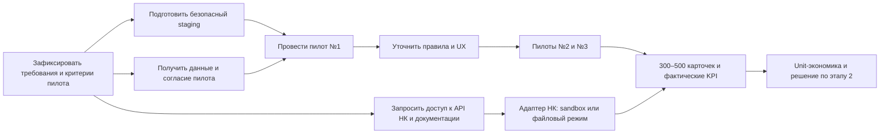

# План завершения стартап-проекта «НК ЛАБ»

**Актуально на:** 24 августа 2026 года  
**Горизонт основного плана:** 28 июля — 31 декабря 2026 года  
**Цель:** завершить этап 1 не только как программный прототип, а как проверенный на реальных клиентах MVP, готовый к платной эксплуатации и переходу к внешним интеграциям.

## 1. Что считать завершением проекта

В рамках этого документа «закончить стартап-проект» означает **закрыть этап 1 и доказать жизнеспособность продукта**. Стартап не заканчивается выпуском кода: должны одновременно сойтись продукт, пилоты, эксплуатация и экономика.

Этап 1 считается завершённым, если выполнены все обязательные условия:

- [ ] Развёрнут стабильный пилотный контур с PostgreSQL, объектным хранилищем, резервным копированием, мониторингом и безопасными настройками.
- [ ] Три пилотных клиента прошли согласованный сценарий работы с реальными данными.
- [ ] Через систему проведено суммарно 300–500 карточек товаров.
- [ ] Подтверждена библиотека правил и шаблонов для 3–5 выбранных категорий одежды.
- [ ] Измерены время обработки карточки, доля автоматического заполнения, доля возвратов, трудозатраты оператора и стоимость обработки.
- [ ] Подготовлен датасет спорных карточек с обезличиванием, схемой разметки и правилами доступа.
- [ ] Реализован API-ready слой для Национального каталога: адаптер, журнал обмена, идемпотентность, обработка ошибок и тестовый/файловый режим.
- [ ] Выполнен хотя бы один воспроизводимый обмен с 1С/ERP: согласованный профиль выгрузки и импорта на данных пилота. Полноценный онлайн-коннектор не обязателен для этапа 1.
- [ ] Сформирована unit-экономика на фактических данных пилотов и принято решение `Go / Rework / Stop` по этапу 2.
- [ ] Есть финальная версия продукта, эксплуатационная документация, отчёт по пилотам и приоритизированный backlog этапа 2.

## 2. Текущее состояние проекта

### Уже реализовано

- Модульный монолит: FastAPI, SQLAlchemy, Alembic, PostgreSQL/SQLite.
- Регистрация и вход по JWT, роли клиента и оператора.
- Импорт Excel и CSV; упрощённый импорт 1С как CSV с разделителем `;`.
- Построение вариаций по цвету, размеру, полу и комплектности.
- Каталог карточек, фильтры, группировка по моделям, редактирование и статусы.
- Ядро правил: обязательные атрибуты, разделение вариаций, формат и контрольная цифра GTIN, уникальность GTIN, структура и срок РД.
- Прототип онтологии для 8 кодов категорий одежды.
- Консоль оператора с перепиской, историей, SLA, возвратом клиенту и массовым назначением.
- Управляемые пилоты с фиксированной выборкой, участниками, отдельными KPI и CSV-отчётом.
- Рабочий React-интерфейс и Docker-контур `web + api + db`.
- 89 backend-тестов проходят; backend-линтер, frontend type-check и production-сборка проходят.
- Добавлены pilot-ready функции: история изменений, версии правил, протокол импорта,
  профили колонок, массовые операции, KPI пилота и расширенный операторский workflow.
- Реализован API-ready обмен с НК (`file/mock/api`) и базовый CommerceML 2.x.

### Что пока является упрощением или отсутствует

- Кнопка публикации меняет только внутренний статус; реального обмена с НК нет.
- Нет подключения к реестрам GS1, Росаккредитации, ЦРПТ, True API и СУЗ.
- Нет полноценного онлайн-коннектора 1С/ERP.
- Онтология не подтверждена как полный официальный набор требований НК.
- Справочники и правила ещё не подтверждены экспертом на данных 3–5 пилотных категорий.
- Staging, резервное копирование и восстановление подготовлены в коде, но нет
  зафиксированного результата реального restore drill в пилотном окружении.
- Базовые метрики собираются, однако baseline ручного процесса, стоимость часа
  оператора и unit-экономика требуют данных владельца пилота.
- Нет frontend E2E-набора и фактического sandbox-прогона API НК.
- В репозитории нет подтверждения трёх пилотов, 300–500 обработанных карточек, измеренных KPI, unit-экономики и платного спроса.

## 3. Решения по противоречиям в исходных документах

### API Национального каталога

Word-план требует подключить API НК в октябре 2026 года, а презентация относит API НК к этапу 2. Решение:

- обязательный результат этапа 1 — готовый интеграционный адаптер, тесты контракта, журнал обмена и тестовый либо файловый обмен;
- боевая публикация в НК выполняется на этапе 1 только при получении документации, тестового контура и учётных данных не позднее 31 августа;
- если доступ не получен, отсутствие боевой публикации не блокирует завершение MVP, но фиксируется как внешний blocker этапа 2;
- до реальной интеграции интерфейс не должен создавать впечатление, что данные отправлены во внешнюю систему.

### Интеграция с 1С/ERP

Для этапа 1 обязательна одна интеграция в узком смысле: согласованный профиль выгрузки, устойчивый импорт и обратный отчёт об ошибках на данных одного пилота. Прямой обмен через 1С EnterpriseData/API переносится в этап 2.

### Бюджет

В презентации одновременно указаны 3,2 млн ₽ в смете и 4,5 млн ₽ на дорожной карте этапа 1. До начала платных работ необходимо сделать единую финансовую модель и зафиксировать, включает ли сумма ФОТ основателей, внешнюю разработку, инфраструктуру, продажи и операторов.

## 4. Критический путь

Главные зависимости:

1. Без реальных данных пилотов нельзя подтвердить правила, собрать датасет и посчитать экономику.
2. Без доступа к API НК нельзя обещать боевую публикацию, но можно завершить адаптер и тестовый обмен.
3. Без staging, резервного копирования и изоляции данных нельзя безопасно загружать клиентские данные.

## 5. План работ по этапам

Обозначения исполнителей:

- **Разработка / Codex** — код, тесты, миграции, CI/CD, техническая и пользовательская документация.
- **Основатель / Product** — приоритеты, пилоты, цены, договорённости и финальное принятие результата.
- **Эксперт НК / Catalog** — проверка правил, атрибутов, РД и регуляторных изменений.
- **Пилотный клиент** — реальные данные, обратная связь и подтверждение результата.

### Этап 0. Аудит и фиксация границ — 28 июля–7 августа

**Цель:** превратить текущий прототип в управляемый проект с измеримым результатом.

- [ ] `P0-01` Создать единый backlog: `Must / Should / Later`, связать задачи с критериями завершения этапа 1.  
  **Исполнитель:** Разработка / Product.
- [ ] `P0-02` Зафиксировать 3–5 пилотных категорий одежды и назначить эксперта, принимающего правила.  
  **Исполнитель:** Product / Catalog.
- [ ] `P0-03` Описать сценарий пилота: формат входных данных, объём, роли, SLA, ожидаемый выход, порядок исправления ошибок.  
  **Исполнитель:** Product / Разработка.
- [ ] `P0-04` Зафиксировать формулы KPI и начальные значения ручного процесса клиента.  
  **Исполнитель:** Product / Пилот.
- [ ] `P0-05` Запросить у партнёра документацию, тестовый контур и учётные данные API НК; отдельно уточнить условия True API и СУЗ.  
  **Исполнитель:** Product.
- [ ] `P0-06` Добавить CI: backend tests + ruff, frontend type-check + build, проверка миграций и сборка Docker-образов.  
  **Исполнитель:** Разработка.
- [ ] `P0-07` Разобрать npm-уязвимости без автоматического breaking-upgrade; зафиксировать решение по каждой.  
  **Исполнитель:** Разработка.
- [ ] `P0-08` Ввести production-проверки конфигурации: запрет дефолтного секрета, список CORS-доменов, отключение демо-аккаунтов, лимиты загрузки.  
  **Исполнитель:** Разработка.
- [ ] `P0-09` Подготовить staging и шаблон релиза с версией, миграциями и rollback-процедурой.  
  **Исполнитель:** Разработка.
- [ ] `P0-10` Согласовать правила обработки, хранения, обезличивания и удаления клиентских данных.  
  **Исполнитель:** Product / Catalog.

**Контрольная точка:** backlog принят, критерии пилота подписаны, staging доступен, все автоматические проверки выполняются в CI.

### Этап 1. Pilot-ready продукт и пилот №1 — 8–31 августа

**Цель:** безопасно провести первые реальные карточки через полный внутренний workflow.

- [ ] `P1-01` Добавить версионирование правил и справочников: версия набора правил сохраняется вместе с результатом валидации.  
  **Исполнитель:** Разработка / Catalog.
- [ ] `P1-02` Подтвердить требования для первой категории по официальным материалам и данным пилота; добавить тест-кейсы на каждое обязательное правило.  
  **Исполнитель:** Catalog / Разработка.
- [ ] `P1-03` Расширить модель карточки недостающими сущностями этапа 1: упаковка, источник данных, версия правил, служебные комментарии.  
  **Исполнитель:** Разработка.
- [ ] `P1-04` Добавить историю изменений и аудит: кто, когда и какие поля изменил, валидировал и перевёл в новый статус.  
  **Исполнитель:** Разработка.
- [ ] `P1-05` Сделать протокол импорта: ошибки по строкам и колонкам, скачиваемый отчёт, повторная загрузка исправленного файла.  
  **Исполнитель:** Разработка.
- [ ] `P1-06` Добавить профили сопоставления колонок и сохранить отдельный профиль для выгрузки пилота из 1С/ERP.  
  **Исполнитель:** Разработка / Пилот.
- [ ] `P1-07` Реализовать массовую валидацию, массовое исправление безопасных полей и экспорт выбранных карточек.  
  **Исполнитель:** Разработка.
- [ ] `P1-08` Проверить изоляцию данных разных клиентов интеграционными тестами для всех CRUD-операций и задач оператора.  
  **Исполнитель:** Разработка.
- [ ] `P1-09` Настроить PostgreSQL, S3-совместимое хранилище, резервное копирование и тест восстановления на staging.  
  **Исполнитель:** Разработка.
- [ ] `P1-10` Провести пилот №1 на 50–100 карточках и зарегистрировать все ошибки, время работы и ручные обходы.  
  **Исполнитель:** Product / Catalog / Пилот.

**Контрольная точка:** первый клиент завершил сценарий от импорта до статуса «готово к публикации»; есть исходные KPI и список дефектов по приоритету.

### Этап 2. Правила, операторский workflow и пилот №2 — 1–30 сентября

**Цель:** сделать обработку повторяемой для нескольких категорий и разных источников данных.

- [ ] `P2-01` Подтвердить и покрыть тестами правила для 3–5 выбранных категорий.  
  **Исполнитель:** Catalog / Разработка.
- [ ] `P2-02` Добавить управляемые справочники значений и нормализацию синонимов: цвет, размер, пол, состав, страна, тип изделия.  
  **Исполнитель:** Разработка / Catalog.
- [ ] `P2-03` Уточнить валидацию РД: тип, номер, даты, срок, связь с карточками и понятное объяснение ошибки.  
  **Исполнитель:** Catalog / Разработка.
- [x] `P2-04` Доработать очередь оператора: назначение, комментарии, причина эскалации, SLA, фильтры и массовые действия.  
  **Исполнитель:** Разработка.
- [ ] `P2-05` Встроить сбор продуктовых метрик без сохранения чувствительного содержимого карточек в аналитике.  
  **Исполнитель:** Разработка.
- [ ] `P2-06` Создать схему разметки спорных карточек, экспорт обезличенного датасета и журнал согласий.  
  **Исполнитель:** Catalog / Разработка.
- [ ] `P2-07` Провести usability-тест основного пути и исправить блокирующие проблемы интерфейса.  
  **Исполнитель:** Product / Разработка.
- [ ] `P2-08` Провести пилот №2 и довести общий объём до 150–250 карточек.  
  **Исполнитель:** Product / Catalog / Пилот.

**Контрольная точка:** два клиента проходят один и тот же процесс; правила для выбранных категорий версионированы; спорные случаи попадают в управляемый датасет.

### Этап 3. Интеграционный слой НК — 1–31 октября

**Цель:** доказать техническую готовность к внешнему обмену, не подменяя реальную интеграцию сменой внутреннего статуса.

- [ ] `P3-01` Выделить порт интеграции НК из доменной логики: внутренний формат карточки не должен зависеть от конкретного API.  
  **Исполнитель:** Разработка.
- [ ] `P3-02` Реализовать mapping внутренней карточки в контракт НК и обратное преобразование ошибок.  
  **Исполнитель:** Разработка / Catalog.
- [ ] `P3-03` Добавить журнал обмена: correlation ID, запрос, ответ, статус, число попыток, время и безопасная маскировка данных.  
  **Исполнитель:** Разработка.
- [ ] `P3-04` Реализовать идемпотентность, повторные попытки, таймауты и ручной повтор неуспешной операции.  
  **Исполнитель:** Разработка.
- [ ] `P3-05` Добавить contract-тесты и mock/sandbox-адаптер. При наличии доступа — провести тестовый обмен с НК.  
  **Исполнитель:** Разработка.
- [ ] `P3-06` При отсутствии API-доступа сделать утверждённый файловый экспорт и импорт протокола ошибок, сохранив тот же интерфейс адаптера.  
  **Исполнитель:** Разработка / Catalog.
- [ ] `P3-07` Переименовать действие публикации в соответствии с реальным результатом: «Готово к публикации» для внутреннего режима и «Отправить в НК» только для подключённой интеграции.  
  **Исполнитель:** Product / Разработка.
- [ ] `P3-08` Исправить проблемы по итогам двух пилотов и довести общий объём до 200–300 карточек.  
  **Исполнитель:** Разработка / Product.

**Контрольная точка:** обмен воспроизводим через sandbox или файловый режим; каждая операция прослеживается; интерфейс честно показывает внешний и внутренний статусы.

### Этап 4. Пилот №3 и эксплуатационная готовность — 1–30 ноября

**Цель:** проверить масштабирование процесса и подготовить продукт к регулярной эксплуатации.

- [ ] `P4-01` Подключить третьего пилотного клиента и довести общий объём до 300–400 карточек.  
  **Исполнитель:** Product / Catalog.
- [ ] `P4-02` Реализовать интерфейс подготовки задания на заказ кодов: SKU, GTIN, количество, партия и экспорт. Фактический заказ в СУЗ остаётся отдельной интеграцией этапа 2.  
  **Исполнитель:** Разработка / Catalog.
- [ ] `P4-03` Добавить роли и права, необходимые пилотам: администратор клиента, редактор, наблюдатель, оператор.  
  **Исполнитель:** Разработка.
- [ ] `P4-04` Настроить структурированные логи, health/readiness checks, сбор ошибок, метрики и алерты.  
  **Исполнитель:** Разработка.
- [ ] `P4-05` Проверить резервное восстановление, миграцию staging → production и rollback релиза.  
  **Исполнитель:** Разработка.
- [ ] `P4-06` Провести базовую проверку безопасности: зависимости, авторизация, загрузка файлов, rate limiting, секреты и tenant isolation.  
  **Исполнитель:** Разработка.
- [ ] `P4-07` Разделить frontend-бандл по маршрутам и убрать подтверждённые уязвимости высокой серьёзности.  
  **Исполнитель:** Разработка.
- [ ] `P4-08` Подготовить пользовательское руководство, инструкцию оператора, runbook поддержки и шаблон сообщения об инциденте.  
  **Исполнитель:** Разработка / Product.
- [ ] `P4-09` Проверить три ценовых сценария на фактических трудозатратах: SaaS, managed service, enterprise/API.  
  **Исполнитель:** Product.

**Контрольная точка:** три пилота работают в стабильном контуре; восстановление проверено; критические проблемы безопасности закрыты; поддержка может воспроизвести типовые операции по runbook.

### Этап 5. Закрытие этапа 1 — 1–31 декабря

**Цель:** получить доказательства результата и принять решение о продолжении.

- [ ] `P5-01` Довести суммарный объём до 300–500 обработанных карточек и зафиксировать разбивку по клиентам и категориям.  
  **Исполнитель:** Product / Catalog.
- [ ] `P5-02` Выпустить библиотеку шаблонов и правил версии `1.0` для 3–5 категорий.  
  **Исполнитель:** Catalog / Разработка.
- [ ] `P5-03` Закрыть все критические и высокие дефекты; остальные оформить как backlog с владельцем и сроком.  
  **Исполнитель:** Разработка / Product.
- [ ] `P5-04` Провести регрессионный тест полного пути: импорт → вариации → проверка → оператор → готовность к публикации → экспорт/обмен.  
  **Исполнитель:** Разработка.
- [ ] `P5-05` Подготовить отчёт по каждому пилоту: исходная проблема, объём, время, ошибки, результат, отзыв и готовность продолжить.  
  **Исполнитель:** Product.
- [ ] `P5-06` Рассчитать фактическую unit-экономику: CAC-гипотеза, выручка, труд оператора, инфраструктура, поддержка, маржа и срок окупаемости.  
  **Исполнитель:** Product.
- [ ] `P5-07` Свести смету этапа 1 и устранить расхождение 3,2/4,5 млн ₽.  
  **Исполнитель:** Product.
- [ ] `P5-08` Получить минимум одно подтверждение коммерческого продолжения: оплата, договор, LOI или согласованный платный пилот.  
  **Исполнитель:** Product.
- [ ] `P5-09` Выпустить релиз этапа 1, changelog, архитектурную схему, API-описание и эксплуатационный пакет.  
  **Исполнитель:** Разработка.
- [ ] `P5-10` Провести итоговый `Go / Rework / Stop review` и утвердить задачи, бюджет и команду этапа 2.  
  **Исполнитель:** Product / команда.

**Контрольная точка:** все пункты раздела «Что считать завершением проекта» имеют ссылку на проверяемое доказательство.

## 6. KPI пилотов

Точные целевые значения необходимо утвердить до 7 августа после измерения ручного процесса. Стартовые ориентиры:

| KPI | Как считать | Ориентир этапа 1 |
|---|---|---:|
| Успешный импорт | Строки, принятые без технической ошибки / все строки согласованного шаблона | ≥ 95% |
| Валидация с первого прохода | Карточки без ошибок после первого запуска / все карточки | Измерить baseline и улучшать по пилотам |
| Снижение времени | Медианное время на готовую карточку до и после НК ЛАБ | ≥ 30% |
| Возврат на доработку | Карточки, возвращённые после операторской проверки / проверенные карточки | Тренд снижается от пилота №1 к №3 |
| Автозаполнение | Поля, заполненные из импорта/нормализации / все заполненные обязательные поля | Измерять по категории |
| Труд оператора | Минуты ручной работы / готовая карточка | Снижается от пилота №1 к №3 |
| Качество изоляции | Подтверждённые случаи доступа к данным другого клиента | 0 |
| Критические дефекты | Открытые дефекты, блокирующие пилот или создающие риск потери данных | 0 к релизу |
| Восстановление | Успешное восстановление из резервной копии в тестовом контуре | 100% проверок |
| Коммерческий сигнал | Оплата, договор, LOI или платный следующий этап | ≥ 1 клиент |

## 7. Реестр основных рисков

| Риск | Ранний сигнал | Действие |
|---|---|---|
| Нет доступа к API НК | Нет документации/тестового контура к 31 августа | Закрыть адаптер, mock и файловый обмен; боевой API вынести в этап 2 |
| Задерживаются пилоты | Нет данных и согласованного сценария за 10 рабочих дней до старта | Держать резервного пилота; начинать с одной категории и 50 карточек |
| Правила НК изменились | Эксперт находит расхождения с текущими требованиями | Версионировать правила, фиксировать источник и дату, запускать регрессию |
| Низкое качество исходных данных | Более 20% строк нельзя разобрать | Профиль импорта, отчёт ошибок, обязательный preflight шаблона |
| Ручной труд не снижается | Минуты оператора на карточку не улучшаются после двух пилотов | Автоматизировать только три наиболее частых причины ручной работы |
| Утечка клиентских данных | Ошибка tenant-фильтра или лишние данные в логах | Остановить пилот, исправить, провести аудит и ротацию секретов |
| Разрастание объёма | В этап 1 попадают печать, vision, PLC/HMI или новые товарные группы | Перенести в этап 2/3, если это не требуется для доказательства MVP |
| Экономика не сходится | Труд оператора и поддержка съедают SaaS-маржу | Пересчитать тариф, ограничить SLA, начать с managed service |

## 8. Что не делать до завершения этапа 1

- Не строить микросервисы, брокеры, Kubernetes и ML-платформу без подтверждённой нагрузки.
- Не начинать промышленную интеграцию PLC/HMI, vision и принтер-аппликаторов.
- Не расширять продукт на обувь, косметику и другие категории до подтверждения одежды.
- Не обещать проверку подлинности GTIN или РД без реального доступа к соответствующему реестру.
- Не называть внутреннюю смену статуса публикацией в Национальном каталоге.
- Не автоматизировать редкие исключения раньше, чем измерены самые частые причины ручной работы.

## 9. Внешние данные и решения, необходимые от команды

Эти пункты нельзя закрыть одной разработкой:

- контакты трёх пилотных клиентов и резервного кандидата;
- обезличенные примеры реальных файлов и разрешение на их использование;
- эксперт, принимающий правила НК, GTIN и РД;
- документация и доступы к тестовым контурам НК/True API/СУЗ;
- домен, облако, S3-бакет, политика резервного хранения и ответственный за production;
- юридические условия обработки клиентских данных и шаблоны пилотных договоров;
- тарифы, стоимость часа оператора, бюджет продаж и инфраструктуры;
- решение о том, какое подтверждение спроса достаточно для перехода к этапу 2.

## 10. Первые задачи разработки

После утверждения этого плана я буду выполнять техническую часть в таком порядке:

1. Добавлю CI и единые команды проверки проекта.
2. Исправлю production-конфигурацию, CORS, секреты, демо-режим и лимиты загрузки.
3. Подготовлю staging, миграции, резервное копирование и проверку восстановления.
4. Добавлю историю изменений и версию правил в результат валидации.
5. Реализую подробный отчёт импорта и профили сопоставления колонок.
6. Покрою tenant isolation и новые критические сценарии интеграционными тестами.
7. Расширю правила и модель данных для согласованных категорий и упаковок.
8. Добавлю сбор пилотных KPI и экспорт обезличенного датасета спорных кейсов.
9. Создам интерфейс адаптера НК, mock/sandbox-реализацию и журнал обмена.
10. Проведу регрессию, оптимизирую frontend-бандл и соберу релизный пакет этапа 1.

Каждая задача считается выполненной только после тестов, обновления документации и проверки пользовательского сценария.

## 11. План этапа 2 после успешного MVP

Этап 2 запускается только после решения `Go`:

- боевая интеграция с API НК и синхронизация изменений;
- онлайн-коннектор 1С/ERP;
- интеграция с True API/СУЗ для заказа кодов;
- задания на печать, реестр кодов и пилот с оператором маркировки;
- биллинг, тарифные лимиты и расширенный RBAC;
- 20 платных клиентов и управляемый SLA;
- накопление датасета спорных карточек без преждевременного вывода ML в production.

Промышленная линия, PLC/HMI, камеры и машинное зрение относятся к отдельному этапу после подтверждения спроса на фабриках.

## 12. Источники плана

- Текущее состояние кода и документации репозитория.
- `README.md`, `ARCHITECTURE.md`, `STACK.md`.
- `docs/КАК-РАБОТАТЬ.md`, `docs/КАК-ЭТО-РАБОТАЕТ.md`.
- `НК_ЛАБ_план_работ_июль_декабрь_2026.docx`.
- `NC_Lab_startup_deck_v2 2.pdf`.
